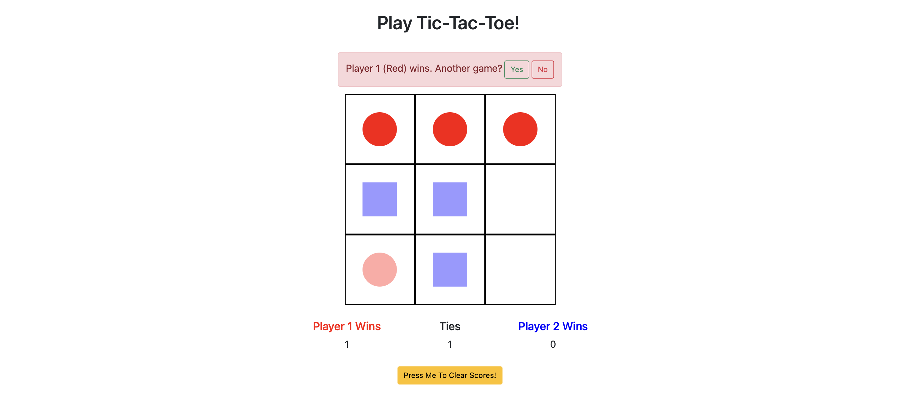

# Tic-Tac-Toe

Use [Tic-Tac-Toe](https://imarijoyborda.com/tic-tac-toe/) to play tic-tac-toe with a friend (local). 

Motivation: I implemented this game to practice OOP (Object Oriented Programming).

Link to project:[https://imarijoyborda.com/tic-tac-toe/](https://imarijoyborda.com/tic-tac-toe/). 

## How To Use
Play the classic tic-tac-toe. Click on an empty grid to place your move. Rules for classic tic-tac-toe applies here. 

Number of wins for each player are recorded and saved on the local storage. To clear this record, press the yellow button below that says `Press Me to Clear Scores!` 

## How It's Made
Tech used: HTML, CSS, Bootstrap, and JavaScript.

## Future Improvements
There are still lots that need to be improved in this web application. Some plans are:
* Improve UI
* Change turn to Player 2 on next game
* Support custimization of color and shape of each player's move.

Contributions are also very welcome! Just issue a pull request.
